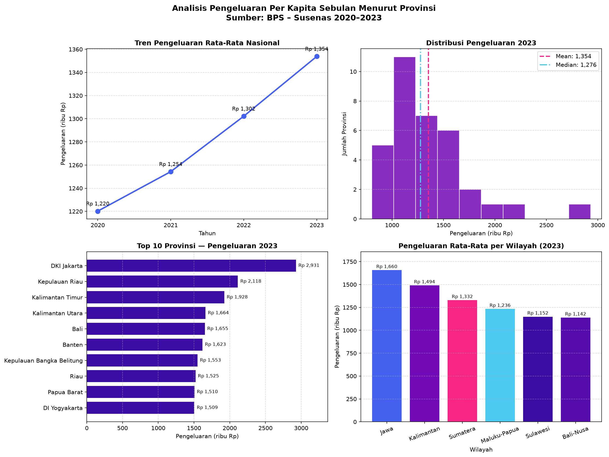

# 📊 Analisis & Parsing Dataset Open Data BPS

Repository ini berisi solusi untuk **Soal 5 [Studi Kasus Open Data]**, yaitu melakukan pemuatan (parsing), analisis statistik deskriptif, dan visualisasi data pengeluaran per kapita sebulan menurut provinsi di Indonesia dari portal data publik BPS (Badan Pusat Statistik).

---

## 📌 Dataset Overview

- **Sumber**: Portal Resmi BPS / Open Data (Susenas 2020–2023)
- **Tabel**: Rata-rata Pengeluaran Per Kapita Sebulan Menurut Provinsi (dalam Ribu Rupiah)
- **Cakupan**: 34 Provinsi di Indonesia (di-grouping ke dalam 6 wilayah/pulau)

---

## 📈 Target & Hasil Analisis Statistik Deskriptif

Script `analisis_bps.py` melakukan 4 jenis analisis utama:

1. **Statistik Deskriptif Dasar**:
   - Menghitung *Mean*, *Median*, *Standard Deviation*, *Min*, *Max*, *Range*, dan *Coefficient of Variation (CV%)*.
   - Temuan: Skewness bernilai positif (Mean > Median) setiap tahunnya karena tingginya pengeluaran di beberapa provinsi tertentu seperti DKI Jakarta.

2. **Distribusi & Percentile (2023)**:
   - Evaluasi Percentile $P_{10}$ hingga $P_{95}$.
   - Pengelompokan Kategori:
     - **Rendah (< Rp 1 Juta)**: 5 Provinsi (14.7%)
     - **Menengah (Rp 1–1.5 Juta)**: 19 Provinsi (55.9%)
     - **Tinggi (> Rp 1.5 Juta)**: 10 Provinsi (29.4%)

3. **Pertumbuhan & Korelasi Antar Tahun**:
   - Laju pertumbuhan rata-rata nasional konsisten meningkat dari +2.80% (2021) hingga +3.97% (2023).
   - Matriks korelasi antar tahun sangat tinggi ($r > 0.999$), menunjukkan pola ketimpangan pengeluaran antar provinsi relatif konstan dari tahun ke tahun.

4. **Ranking & Perbandingan Regional**:
   - **Top 3 Pengeluaran Tertinggi (2023)**: DKI Jakarta (Rp 2.931rb), Kepulauan Riau (Rp 2.118rb), Kalimantan Timur (Rp 1.928rb).
   - **Bottom 3 Pengeluaran Terendah (2023)**: Nusa Tenggara Timur (Rp 802rb), Lampung (Rp 964rb), Nusa Tenggara Barat (Rp 968rb).

---

## 🖼️ Visualisasi Data

Hasil visualisasi disimpan secara otomatis sebagai file image `analisis_pengeluaran_bps.png` yang mencakup:
- Tren Rata-Rata Nasional (Line Chart)
- Distribusi Pengeluaran 2023 (Histogram)
- Top 10 Provinsi (Horizontal Bar Chart)
- Pengeluaran Rata-Rata per Wilayah/Pulau (Bar Chart)



---

## 🚀 Cara Menjalankan Project

1. **Clone Repository**:
   ```bash
   git clone https://github.com/AnataSim/parsing-dataset-bps.git
   cd parsing-dataset-bps
   ```

2. **Install Dependensi**:
   ```bash
   pip install pandas numpy matplotlib
   ```

3. **Jalankan Script Analisis**:
   ```bash
   python analisis_bps.py
   ```

---

## 📁 Struktur File

```text
parsing-dataset-bps/
├── analisis_bps.py                      # Script utama Python (Parsing, Statistik & Visualisasi)
├── dataset_pengeluaran_perkapita_bps.csv # Dataset hasil export CSV
├── analisis_pengeluaran_bps.png         # Gambar grafik hasil visualisasi data
└── README.md                             # Dokumentasi proyek
```
